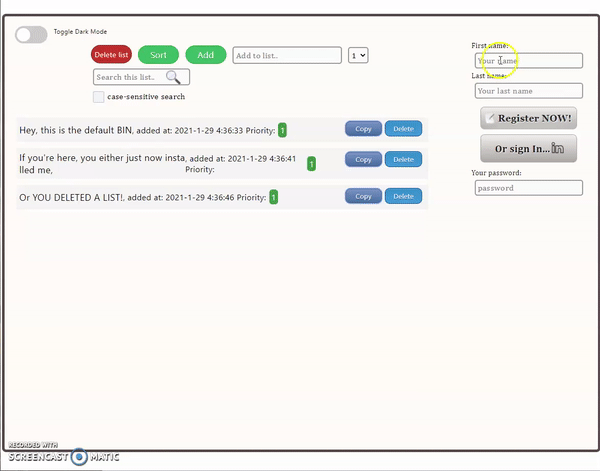
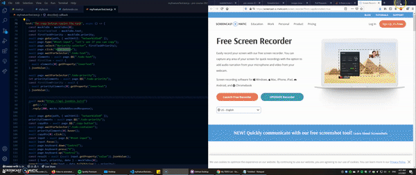

# A ToDo list - by Koren, a Cyber 4s Pre-course student

# Introduction

This is my pre-course final project - a todo list with all sorts of nice features like online registration, persistent lists and user passwords.

## Usage

Simply visit [the github page](https://korenezri.github.io/pre-course-2021-final-boilerplate/src/), sign up and start writing down your tasks!

## Usage: Features

* Mobile version.
* Fully implemented sign-up form that allows you to log-in and save your list online.
* Dark mode.
* Option to prioritise tasks - and sort the list accordingly.
* Search the list - case-sensitive toggle switch available.
* Mark items as done.
* Delete items.
* Create as many lists as you want! All you need to do is write down your passwords for each of them.
* Task-counter, and finished-task-counter are both available.
* Copy list items with the click of a button!
* A test I made myself using Puppeteer.
* The no-task monster, who likes to stare into lazy people's souls at night.
* Slick design with more to come.

## Features: showcase
### The app and general design:

### Mobile versions:

### My new test:
(the test is designed to check whether a list item's "Copy!" button works. It will have to hover over a list item to check the copy button's functionality, because that button only appears when hovering.

## Contributing
Pull requests are welcome. For major changes, please open an issue first to discuss what you would like to change.
Please make sure to update tests as appropriate.

## Current Contributors and credits

Me, just me as a contributor.
Credit also goes to https://jsonbin.io/ for making a lot of this possible.

## License
Koren Ben Ezri, 2021
