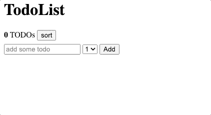
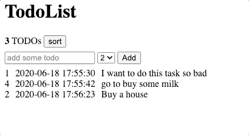

#  Pre Course Project - Todo List

This project will include most of the topics we have learnt so far.
This repository includes a basic skeleton template with automated tests, use it for your submissions.

In this project you will create a Todo List Web Application, in which the user can store prioritized _todo tasks_ and view/sort that list.

Here is a preview sample of the desired functionality (without styling):



## Instructions

- Fork this repository into your account. Make sure to select the **public** option
- Clone your new repository to your computer
- Install the project dependencies by running `npm install` from the vscode terminal `ctrl + j` (make sure you are in the correct directory)
<!-- - [Create new branch](https://docs.github.com/en/desktop/contributing-and-collaborating-using-github-desktop/managing-branches) -->
- Make changes to the code to meet the project requirements
- [Commit Early, Push Often](https://www.worklytics.co/commit-early-push-often/) - your work will be evaluated by your push history
- Good Luck!

## Running tests

We have created automated tests for your convenience, use it to check your progression.

Note that the automated tests rely on your code having the exact class names, Ids and objects structures as specified below.

To run the tests locally simply run `npm run test` in the terminal

Note that each commit to `main` branch will trigger a github [action](https://docs.github.com/en/actions). You can easily see the action tests result on each commit:


## Guidelines

- The Todo list should have two sections: _Control_ section and _View_ section
- The _Control_ section is where the user adds his todo task and priority, and should have three elements:
  - [\<input\>](https://developer.mozilla.org/en-US/docs/Web/HTML/Element/input) with id `text-input`.
  - [\<select\>](https://developer.mozilla.org/en-US/docs/Web/HTML/Element/select) with id `priority-selector` (options will be: 1-5).
  - [\<button\>](https://developer.mozilla.org/en-US/docs/Web/HTML/Element/button) with id `add-button`.
- The _View_ section is where we display the list of added todo tasks and data and should start empty. Each added todo should be inserted to the list.
- After the user clicks on the 'add button' you need to "reset" the input value
- Every todo item should have a "container" div with class `todo-container` that will contain 3 sub-elements:

  - An element with a class `todo-text` with the text of the todo task
  - An element with a class `todo-created-at` that will hold the creation time of the task in a [SQL format](https://www.w3schools.com/sql/sql_dates.asp#:~:text=SQL%20Date%20Data%20Types&text=DATE%20%2D%20format%20YYYY%2DMM%2D,YEAR%20%2D%20format%20YYYY%20or%20YY)
  - An element for showing the numeric priority value of the task, with a class `todo-priority`

  Good way 👍🏿:

  ```
    <div class="todo-container">
      <div class="todo-priority">
        1
      </div>
      <div class="todo-created-at">
        2020-06-18 11:51:12
      </div>
      <div class="todo-text">
        the todo text
      </div>
    </div>
  ```

  Bad way 👎🏿:

  ```
    <div class="todo-container">
      <div class="todo-priority">
        1
      </div>
      <div class="todo-created-at">
        2020-06-18 11:51:12
      </div>
      <div class="todo-text">
        <span>the todo text</span>
      </div>
    </div>
  ```

- Add a counter element to reflect the **current** number of todos stored in the app. This element should have an id of `counter`.

- Add a button with id `sort-button`. Clicking this element should resort the todo list by their todos priority (DESC)

  

- **Make your todo-list persistent!**

  Save your todo-list as JSON (see `todo-list-example.json`) and store it in a persistent way, you have to options:

  1. Use the `localStorage` browser api to save / load the todo-list JSON **with the 'my-todo' key**. This option will make it persist between _page reloads_.

  2. Use the [jsonbin.io](https://jsonbin.io/) service api (using async/await fetch GET & PUT requests) to save / load your todo-list JSON. This option will make it persist across _devices and browsers_. (**This will also grant you +20 bonus pts**).

**Note** You can add extra properties to the todo objects in the JSON that you want to be persistent.

## Bonus

- Add a new test to check any bonus feature you implemented _(10pts)_
- Add a drag n' drop functionality. [This](https://htmldom.dev/drag-and-drop-element-in-a-list) might be helpful _(10pts)_
- Add a way to delete tasks (bonus on bonus - undo option) _(5pts)_
- Add a way to search tasks _(5pts)_
- Add a loading spinner if you are using fetch _(5pts)_
- Dark mode _(5pts)_

- Add any other cool functionality that you want to your app!

  We suggest taking ideas from [htmldom](https://htmldom.dev/)

**Add an explanation in `README.md` for each bonus feature you add and a link to any resoure you used**

## Grading policy

- Your project will be graded by the number of automatic tests you pass
- Visual creativity, use css to make this app app AWESOME 💅🏿
- Code quality <!-- variable names, comments, function names? -->
- Git usage <!-- commit messages -->

## Submitting

- Change this file (README.md) and style it to showcase your solution (gifs, explanations, link to the github page, links to resources you used, etc...)
- Submit your solution repo to the ChallengeMe system
- Submit your repo link and github page and video to Google Classroom
- Record a 5-10 min selfie video, describe yourself in a few words (age, location, military background, technological background). Also, talk about the solution you submitted (try to explain how your app works in general and which bonuses you added). Think about this video as an interview.

GOOD LUCK!
